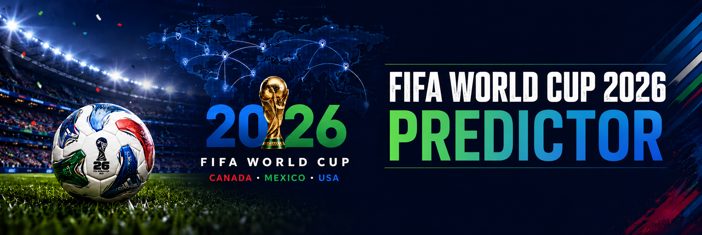

# FIFA World Cup 2026 Predictor

A data science project that predicts all 72 FIFA World Cup 2026 group stage matches using Elo-based modelling and Monte Carlo simulation across 100,000 simulations.



---

## Project Structure

```
wc2026-predictor/
│
├── data/
│   ├── matches_1930_2022.csv          # Historical WC match results
│   ├── fifa_ranking_2022-10-06.csv    # FIFA rankings Oct 2022
│   ├── fifa_ranking_2026-06-08.csv    # FIFA rankings Jun 2026
│   └── schedule_2026.csv              # WC 2026 group stage fixtures
│
├── image/
│   └── image.png                      # Project banner
│
├── outputs/
│   ├── data_check.txt                 # data.py run output
│   ├── train_check.txt                # train_model.py run output
│   └── simulate_check.txt             # simulate.py run output
│
├── predictions/
│   ├── wc2026_predictions.json        # 72 pre-generated match predictions
│   └── wc2026_simulation.json         # Monte Carlo tournament win probabilities
│
├── data.py                            # Loads and processes all datasets
├── train_model.py                     # Elo prediction engine
├── simulate.py                        # Monte Carlo tournament simulator
├── README.md                          # Project documentation
├── requirements.txt                   # Python dependencies
└── .gitignore                         # Files excluded from version control
```

---

## How to Run

Install dependencies:

```bash
pip install -r requirements.txt
```

Verify datasets load correctly (optional):

```bash
python data.py
```

Generate predictions:

```bash
python train_model.py
```

Run Monte Carlo simulation:

```bash
python simulate.py
```

---

## Step 1 — Dataset

**Source:** [Football - FIFA World Cup, 1930 - 2026 (Kaggle)](https://www.kaggle.com/datasets/piterfm/fifa-football-world-cup)

This is the most widely used World Cup dataset on Kaggle, covering every match from 1930 to 2022 along with FIFA rankings. It was chosen because it is the most complete, well-maintained, and actively used dataset for World Cup prediction projects.

Four files are used:

| File                          | Purpose                                               |
| ----------------------------- | ----------------------------------------------------- |
| `matches_1930_2022.csv`       | 688 historical group stage match results for training |
| `fifa_ranking_2022-10-06.csv` | Team strength features for historical matches         |
| `fifa_ranking_2026-06-08.csv` | Team strength for generating 2026 predictions         |
| `schedule_2026.csv`           | All 72 WC 2026 group stage fixtures                   |

---

## Step 2 — Project Structure

The project is split into four Python files, each with a single responsibility:

- `data.py` — loads and cleans all four CSVs
- `train_model.py` — generates predictions using the Elo formula
- `simulate.py` — runs Monte Carlo tournament simulations
- `app.py` — displays everything as a live Streamlit dashboard

Dependencies are listed in `requirements.txt`. Install them with:

```bash
pip install -r requirements.txt
```

| Library     | Why                                      |
| ----------- | ---------------------------------------- |
| `pandas`    | Reading CSVs and building DataFrames     |
| `numpy`     | Math operations in the Elo formula       |
| `streamlit` | The live web dashboard                   |
| `plotly`    | Charts inside the dashboard              |
| `requests`  | Fetching live match results from the API |

---

## Step 3 — Dataset Loading (`data.py`)

`data.py` loads all four CSV files and exposes clean DataFrames to the rest of the project via `load_all()`.

Key functions:

| Function               | What it does                                                            |
| ---------------------- | ----------------------------------------------------------------------- |
| `load_matches()`       | Loads match results, filters to group stage only, drops incomplete rows |
| `load_rankings_2022()` | Loads Oct 2022 rankings as a dict: team -> points                       |
| `load_rankings_2026()` | Loads Jun 2026 rankings as a dict: team -> points                       |
| `load_schedule_2026()` | Loads 2026 fixtures, assigns group letters, generates match IDs         |
| `load_all()`           | Calls all four loaders and returns everything in one call               |

Run `python data.py` to verify all datasets load correctly:

```
[matches]       688 group stage matches loaded (1930-2022)
[rankings 2022] 211 teams loaded (Oct 2022)
[rankings 2026] 211 teams loaded (Jun 2026)
[schedule]      72 fixtures loaded (WC 2026 group stage)
```

---

## Step 4 — Processing (`data.py`)

Raw data from different sources uses inconsistent team names — for example `"Korea Republic"` in one file and `"South Korea"` in another. `data.py` normalises all names through `TEAM_NAME_MAP` before any processing happens, ensuring every team has one consistent name used across all files.

The schedule CSV has no group column — every row just says `"Group stage"` in the Round field. Groups are assigned by looking up each team in `WC2026_GROUPS`, a dict derived from the official December 2025 draw.

---

## Step 5 — Elo Predictions (`train_model.py`)

### What is Elo?

Elo is a rating system originally designed for chess, now used by FIFA as the basis for their official ranking points. The core idea: a team with higher rating points is more likely to win, and the probability is calculated from the gap between the two teams' points.

### Formula

```
P(team1 wins) = 1 / (1 + 10^(-(r1 - r2) / 400))
```

Where `r1` and `r2` are the FIFA ranking points of each team. A difference of 400 points gives the stronger team roughly a 90% chance of winning.

### Logic

The model goes through five steps for each match:

1. **Get FIFA ranking points** for both teams from the June 2026 rankings
2. **Apply host nation boost** — USA, Canada, and Mexico each receive +80 points to reflect home advantage
3. **Compute base Elo probability** using the formula above
4. **Calibrate draw rate** — closely matched teams draw more often; mismatched games rarely end in draws. Base draw rate is 24%, reduced as the ranking gap grows, with a minimum of 10%
5. **Blend in head-to-head history** — if two teams have met 2+ times at a World Cup, their historical win rate nudges the probability by 8%

### Key functions

| Function                              | What it does                                                              |
| ------------------------------------- | ------------------------------------------------------------------------- |
| `build_h2h(matches)`                  | Builds head-to-head win/draw/loss records from all 688 historical matches |
| `elo_win_prob(pts1, pts2)`            | Core Elo formula — returns P(team1 wins)                                  |
| `predict_match(team1, team2, ...)`    | Runs all 5 steps and returns (p_win, p_draw, p_loss)                      |
| `generate_predictions(schedule, ...)` | Runs predict_match for all 72 fixtures and saves to JSON                  |

### Output

`predictions/wc2026_predictions.json` — 72 predictions, each containing:

```json
{
  "match_id": "A1",
  "group": "A",
  "team1": "Mexico",
  "team2": "South Africa",
  "predicted_winner": "Mexico",
  "prob_team1_win": 70.3,
  "prob_draw": 19.8,
  "prob_team2_win": 10.0,
  "status": "upcoming"
}
```

---

## Step 6 — Monte Carlo Simulation (`simulate.py`)

### What is Monte Carlo simulation?

Instead of just picking the most likely winner of each match, Monte Carlo simulation runs the entire tournament thousands of times. In each run, match outcomes are decided by rolling dice weighted by the Elo probabilities. After all runs, we count how often each team won the tournament — that percentage is their World Cup win probability.

### Logic

Each of the 100,000 simulations follows these steps:

1. **Group stage** — simulate all 72 matches, calculate points and goal difference, determine 1st and 2nd place qualifiers from each group plus the best 8 third-place finishers (32 teams total)
2. **Knockout rounds** — simulate Round of 32, Round of 16, Quarter-finals, Semi-finals, and Final. No draws in knockout stage — a drawn match goes to a 50/50 penalty shootout coin flip
3. **Count the winner** — add 1 to the winning team's tally

After 100,000 runs, divide each team's tally by 100,000 to get their win probability.

### Why 100,000?

100,000 is the standard threshold for Monte Carlo simulations in sports analytics research, giving probability estimates accurate to within ±0.1%. Running fewer simulations produces unstable results that change significantly between runs.

### Key functions

| Function                                 | What it does                                                   |
| ---------------------------------------- | -------------------------------------------------------------- |
| `simulate_match(team1, team2, ...)`      | Rolls dice against Elo probabilities to decide a match outcome |
| `simulate_group_stage(predictions, ...)` | Simulates all 72 group matches and returns 32 qualifiers       |
| `simulate_knockout(teams, ...)`          | Simulates the bracket from Round of 32 to the Final            |
| `run_simulation(predictions, ..., n)`    | Runs the full tournament n times and returns win probabilities |

### Results (100,000 simulations)

| Rank | Team      | Win Probability |
| ---- | --------- | --------------- |
| 1    | Argentina | 12.99%          |
| 2    | Spain     | 12.49%          |
| 3    | France    | 11.63%          |
| 4    | England   | 8.76%           |
| 5    | Brazil    | 5.19%           |
| 6    | Mexico    | 4.95%           |
| 7    | Portugal  | 4.64%           |
| 8    | Morocco   | 4.35%           |

**NOTE:** Predictions are based purely on FIFA ranking points and historical results. The model does not account for squad injuries, current form, or tactical factors.

---

## Techniques Used (Data Science)

| What has been used                               | Field                    |
| ------------------------------------------------ | ------------------------ |
| Data cleaning, normalization, merging            | Data Engineering         |
| Elo rating formula                               | Quantitative Modelling   |
| Historical statistics (head-to-head, draw rates) | Statistical Analysis     |
| Monte Carlo simulation                           | Computational Statistics |
| Live API + accuracy tracking                     | Data Pipeline            |
| Streamlit dashboard                              | Data Visualization       |
